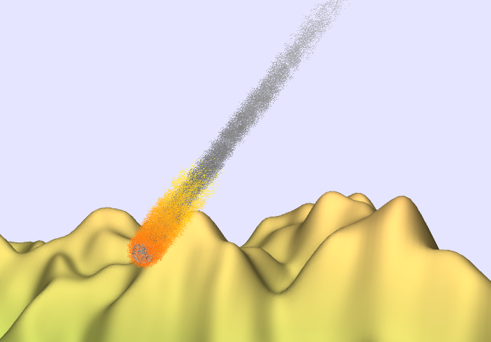

# Abstract

The project is an animation of an asteroid falling through the atmosphere towards the surface of a planet.
The animation includes the asteroid falling, with the option to enable/disable different effects that
surround the asteroid during it's fall. The available effects are a fire trail enveloping the asteroid and
a trail of smoke following the asteroid. The two effects can be combined, and the animation can be freely
paused at any moment. The camera can be moved on the x-y-plane parallel to the ground, zoomed and rotated,
but it can also be set to automatically follow the asteroid.

# Technical approach

## Terrain

We based our project on the WebGL framework provided in the exercises, more specifically the framework from
the last exercise, including the terrain. We played around a bit with the size of the terrain, but we didn't
invest much time, the terrain mostly staying the same as in that exercise.

## Asteroid

For this part of our project the following page was a big inspiration for us: [https://webgl2fundamentals.org/webgl/lessons/webgl-qna-apply-a-displacement-map-and-specular-map.html](https://webgl2fundamentals.org/webgl/lessons/webgl-qna-apply-a-displacement-map-and-specular-map.html).
To create the asteroid we used Bump Mapping and the calculationn of the Pertubed normal in the fragment shader. 
Using the normal mapping in the specular component of the Phong-lightning model we add textures via 
shading to our asteroid. Since this is just emulating rising and lowering in the surface, we need to add
geometry. Therefore we use Displacement Maps in the vertex shader. First we have to set the gl_Position variable
which is a variable holding the position of a vertex is clip space(4 dimensional). Defining a 4 dimensional vector "displace" by setting it 
to the attributed vector "aPosition", we update the three first components by adding the solution of the displacement. That means we add the 
the product of the displacement factor with the texture value of the displacement map and the attribute "aNormal". Transforming this vector 
by the Model-View-Projection-Matrix we get the gl_position vector.
Then we calculate the vertex postions in world coordinates by multiplying by related matrices.

For the asteroid movement we got mostly inspired from the exercise with the planetary system. We however modified the
planet simulation so that the asteroid falls towards the terrain, by implementing a movement pattern that
just goes from point A to point B and then setting up the points for the asteroid so it falls in a nice angle
towards the terrain.

## Particle effects

For the particle systems, we got inspired by the provided example of last year's homework about billboards.
So we first implemented an actor for a single particle, which is always oriented towards the camera and uses
a simple shader showing a simple glow texture. We then later expanded this, such that the shader gets the
alpha based on a noise texture, which can be specified at creation of the particle actor. The particles can
also be provided a color, which is applied to the billboard by the shader. To have correctly shaded particles,
we enabled the depth buffer for the particle rendering, and added a discard instruction in the shader of the
particles, to discard the fragment if the resulting alpha value given by the noise texture and the provided
color is below a certain threshold. In this way the particles are properly shown behind each other, and the
particles behind the asteroid are not visible thanks to the depth buffer.

On top of the particle actor we added a particle emitter actor, which handles the emission of a great number
of particles and which can be customized by providing different parameters at creation. The parameters
include position, velocity of each particle and velocity of the system. This allows a very good customization
of the emission, with also the possibility of giving the position of another actor as position, and the system
will follow that other actor.  
There are also options to control the amount of particles and their spawning, by giving a maximum amount of
particles for the system, the number of particles that will be initially spawned, and the frequency of the
spawning of the particles. Also there is the ability to provide a lifetime that will apply to each particle
spawned by the system.  
To make sure the particles spawned by the system have some randomness in them and don't all move the same way
there are two parameters to control the randomness of the position and the velocity. These two parameters
control the scale of the random vector that's added to the newly spawned particle's position or velocity
respectively.  
Finally the noise texture for each particle can be specified by the name, the size of each particle can be
specified and a start and an end color, between which each particle will interpolate it's color based on
it's lifetime.

### Problems encountered

We at first struggeled a bit with the calculation of the matrix to make the billboard always face the camera, but after
going back to think about how we needed to rotate them we managed to get them correctly.  
Also getting the different parameters right to have a somewhat nice looking effects took quite some time and repeated
trial and error.

# Results

## Video
{ width=90% }

## Live demo

		ICG Project: Asteroid impact
		⁙⁙ docs:
		<a href="https://github.com/regl-project/regl/blob/gh-pages/API.md">regl</a>,
		<a href="http://glmatrix.net/docs/">gl-matrix</a>,
		<a href="https://developer.mozilla.org/en-US/docs/Web/JavaScript">MDN</a>
         
		⁙⁙ mouse: drag to rotate, shift+drag to move
		⁙⁙ scroll to zoom
		⁙⁙ show/hide <strong class="keyboard">z</strong>
        ⁙⁙ pause/unpause <strong class="keyboard">p</strong>

Preset view <strong class="keyboard">1</strong>
Follow asteroid <strong class="keyboard">2</strong>
Toggle fire <strong class="keyboard">f</strong>
Toggle smoke <strong class="keyboard">s</strong>

<pre id="debug-text"></pre>

# Contributions

Elias Boschung: 33%  
* Particle and ParticleSystem actors and their configuration  
* Movement of the asteroid

# Resources

Particle system:  
    - [https://nullprogram.com/blog/2014/06/29/](https://nullprogram.com/blog/2014/06/29/)  
    - [https://webglfundamentals.org/webgl/lessons/webgl-qna-efficient-particle-system-in-javascript---webgl-.html](https://webglfundamentals.org/webgl/lessons/webgl-qna-efficient-particle-system-in-javascript---webgl-.html)  

Procedural generation:  
    - Texturing & Modeling: A Procedural Approach

Water 2D:  
    - [https://gamedev.stackexchange.com/questions/44547/how-do-i-create-2d-water-with-dynamic-waves](https://gamedev.stackexchange.com/questions/44547/how-do-i-create-2d-water-with-dynamic-waves)

