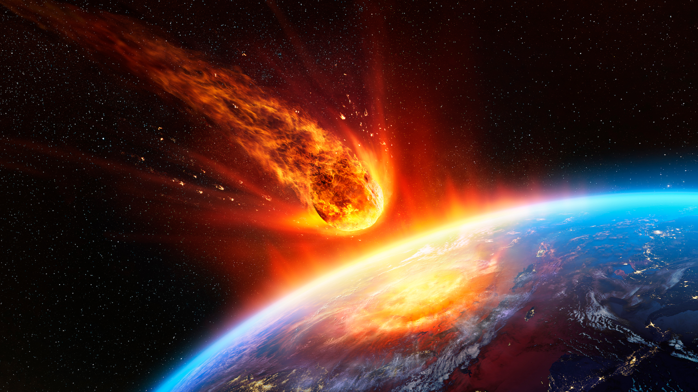
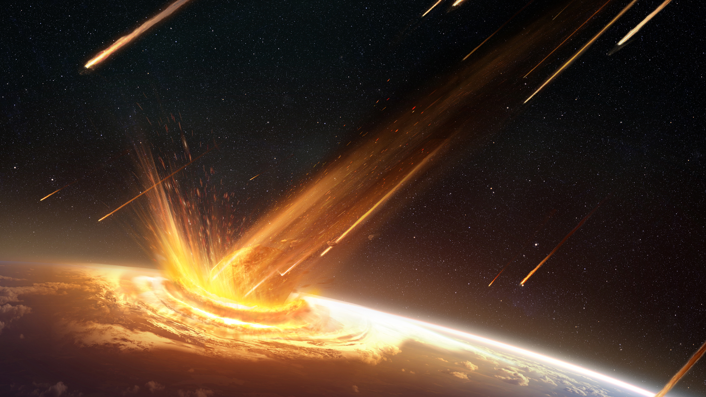

# Title and Summary

### Asteroid Impact

Simulating an asteroid impact on a terrain. 

# Goals and Deliverables

1. Create the asteroid
    - (BASE):   
        Displacement Map: Asteroids aren't round! We will need to make it more realistic using this technique.  
        Textures: Adding different textures depending on the material being used.
    - (EXTENSION)  
        Desintegration upon entering the atmosphere: Making it lose mass as it enters the atmosphere  

2. Asteroid particle effects
    - (BASE)  
        Fire effects: Using particle effects to animating the asteroid  
        Smoke effects: Giving the asteroid a tail of smoke as it plummits.

3. Terrain where asteroid lands
    - (BASE)  
        Land and water: Generating the terrain of the plannet the asteroid might land in. 
    - (EXTENSION)  
        Clouds: Adding aesthetic objects to make the scene prettier  
        Trees: Making the terrain have trees and it's respective relation with the asteroid impact.  
        Impact: Changing the solid terrain so that the asteroids impact will become more realistic.

4. Physics of entering the atmosphere 
    - Equations that make the asteroid enter the atmosphere 

# Schedule

During the first few weeks we'll work on the base of our project. 

This will entail us creating the asteroid with a displacement map on the texture. 

Adding to it the necesarry fire and smoke particle effects for an added layer of realism. 

We'll also generate a terrain on which the asteroid will impact allong with the gravitational equations that will direct it. 

We'll also create a water masses to simulate the asteroid impact on water.

The following weeks we'll work on the extensions and added details to the project. 

Such as making part of the asteriod be able to disintegrate as it enteres the atmosphere or detach becoming in themselves new asteroids.

Adding cosmetic effects such as clouds and trees are also part of our idea

In addition, we'll try to remodel the terrain such that on impact the asteroid is able to create a crater in the ground.

# Resources

Particle system:  
    - [https://nullprogram.com/blog/2014/06/29/](https://nullprogram.com/blog/2014/06/29/)  
    - [https://webglfundamentals.org/webgl/lessons/webgl-qna-efficient-particle-system-in-javascript---webgl-.html](https://webglfundamentals.org/webgl/lessons/webgl-qna-efficient-particle-system-in-javascript---webgl-.html)  

Procedural generation:
    - Texturing & Modeling: A Procedural Approach

